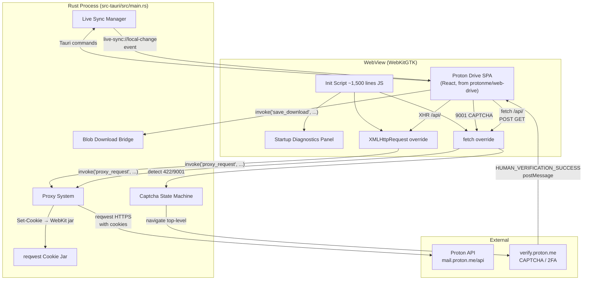

# Architecture

Proton Drive for Linux is a **native desktop client** that wraps the official Proton Drive single-page application (SPA) inside a Tauri 2.0 WebView. This architecture gives you the **real Proton Drive app** — the same React SPA served at `drive.proton.me` — rendered locally with native filesystem integration that Proton doesn't provide on Linux.

## High-level architecture



## Three-layer design

### 1. The Rust backend (`src-tauri/src/`)

Three Rust source files totaling **~3,600 lines**:

| File | Lines | Purpose |
|------|-------|---------|
| `main.rs` | 1,847 | Tauri setup, proxy, SSO, captcha, downloads, init script |
| `live_sync.rs` | 905 | Filesystem watcher + poller, change suppression, remote apply |
| `sync_db.rs` | 839 | SQLite schema, migrations, item tracking, privacy hashing |

Dependencies (from `Cargo.toml`):
- **tauri 2.0** — WebView shell with `protocol-asset` feature
- **reqwest 0.12** — HTTP client with cookie jar (`json`, `cookies` features)
- **notify 6.1** — inotify/FSEvents filesystem watcher
- **rusqlite 0.32** — bundled SQLite for sync state (`bundled` feature)
- **sha2 + hex** — SHA-256 hashing for privacy-preserving path/ID storage
- **base64 0.22** — blob download encoding, remote sync content
- **tokio** — async runtime (`rt-multi-thread`)

### 2. The WebView init script (`initialization_script`)

A **~1,500 line JavaScript string** injected into every page load via `WebviewWindowBuilder::initialization_script()`. It runs *before any SPA code* and installs:

- **fetch override** — intercepts all API calls, routes through Rust proxy
- **XMLHttpRequest override** — same interception for legacy code paths
- **Blob download interception** — hooks `URL.createObjectURL`, `window.open`, anchor clicks, `HTMLAnchorElement.prototype.download`
- **CAPTCHA flow** — detects 9001 responses, navigates to `verify.proton.me`
- **SSO route rewrite** — detects persisted sessions and rewrites `tauri://localhost/` → `tauri://localhost/u/<localId>/`
- **Worker polyfill** — distro-aware Web Worker blocking for systems where WebKitGTK Workers are broken
- **Console bridge** — redirects `console.log/warn/error` → Rust `js_log` command
- **Startup diagnostics** — zero-trust frozen-WebView debugging panel
- **Storage block monitoring** — logs `/storage/blocks` requests for debugging
- **Error boundary** — `window.onerror` + `unhandledrejection` → Rust

### 3. The Proton SPA (build artifact)

The `protonme/web-drive` React application, fetched and built during CI. The build output is served via Tauri's `protocol-asset` feature, which registers `tauri://localhost/` as a custom protocol that Tauri intercepts and serves from the embedded asset directory.

The SPA thinks it's running at `drive.proton.me`, but all network calls go through the Rust proxy.

## How requests flow

### API calls (proxy path)

```
SPA calls fetch('/api/core/v4/auth', { method: 'POST', body: ... })
  → init script overrides fetch
  → collects method, headers, body
  → serializes Tauri IPC invoke chain (prevents concurrent bridge saturation)
  → invoke('proxy_request', { request: { method, url, headers, body } })
  → Rust proxy_request() handler
  → rewrites URL: localhost/api/... → https://mail.proton.me/api/...
  → builds reqwest request with timeout (60s connect, 180s request)
  → attaches cookies from WebKit jar (WebKit manages auth cookies natively)
  → forwards custom headers (x-pm-*, etc.)
  → sends HTTPS request
  → extracts response headers, routes Set-Cookie to WebKit jar
  → returns { status, headers, body } to JS
  → JS constructs Response object, returns to SPA
```

Key design decisions:
- **Cookies live in WebKit, not Rust** — the proxy reads from WebKit's cookie jar and writes Set-Cookie back to it. This means WebKit manages auth, CSRF, and session cookies exactly as a browser would.
- **Serialized IPC** — WebKitGTK's IPC bridge breaks with 5+ concurrent `invoke()` calls. All proxy `invoke()` calls are chained through a serial promise queue, while the actual HTTPS requests parallelize fine on the Rust side.
- **Protocol-relative URL fix** — Proton's SPA sometimes emits `//assets/...` URLs which would resolve to `tauri://assets/...`. These are rewritten to `/assets/...`.

## How SSO works

Proton uses a single sign-on flow: `account.proton.me` → login/2FA → redirect to `drive.proton.me`. The native client rewrites all of this to local URLs:

1. **Login redirects** — `/login` paths are rewritten to `tauri://localhost/account/?product=drive`
2. **account.proton.me** → `tauri://localhost/account/...` (local asset, not remote server)
3. **drive.proton.me** → `tauri://localhost/...` (back to root)
4. **Session restoration** — if localStorage has a `ps-<localId>` key on `tauri://localhost/`, the init script calls `history.replaceState({}, '', '/u/<localId>/')` so React Router starts on the correct user route
5. **Login completion** — after successful auth, the account app redirects through `account.proton.me`, which gets intercepted as a `tauri://localhost/u/<id>/?...` URL. The navigation handler detects this, forces `about:blank` (to kill the account document), then loads Drive fresh so the Drive init script reinstalls all IPC hooks.

## The proxy_request function

Location: `main.rs` lines 362–486

This is the most important Rust command — every API call from the SPA passes through it. The complete flow:

1. **URL rewriting** — converts localhost, `tauri://`, relative, and absolute paths to `https://mail.proton.me/api/...`
2. **Request construction** — `reqwest` client with 60s connect timeout, 180s request timeout
3. **Cookie injection** — reads cookies from WebKit's native jar via `combined_cookie_header()`
4. **Header forwarding** — passes through non-cookie, non-host headers from the frontend
5. **Body passthrough** — forwards request body as raw bytes
6. **Response processing** — extracts status, headers; routes Set-Cookie to WebKit; returns JSON body
7. **Error handling** — returns `502` for connection failures, `504` for timeouts

## Startup flow

1. `main()` sets environment variables to fix WebKitGTK GPU rendering issues (disables DMABUF, compositing, forces Cairo renderer)
2. Creates a shared `reqwest::Client` with Arc-wrapped cookie jar
3. Builds the `AppState` containing `client`, `cookie_jar`, and `sync_manager`
4. Calls `tauri::Builder::default()` with plugins (shell, dialog, notification)
5. In `.setup()`:
   - Creates persistent WebView data directory
   - Builds the WebView window (1200×800 min 800×600)
   - Injects the 1,500-line init script
   - Installs `on_navigation` handler for SSO routing
   - Installs `on_download` handler for native Downloads folder
   - Starts the default sync root (`~/ProtonDrive`)
6. Registers all Tauri commands (proxy, sync, captcha, download)
7. Calls `app.run()`

## Startup diagnostics

A subtle element embedded in the init script: when the app freezes on a loading spinner (a common WebKitGTK regression), there's no visible UI to debug. The diagnostics panel:

- Appears as a fixed-position `<pre>` at the bottom of the WebView
- Shows current URL, document ready/visibility state, localStorage session keys, and pending proxy requests
- Tracks proxy requests with 10s and 30s watchdog timers
- Accessible via `window.__PROTONDRIVE_STARTUP_DIAGNOSTICS__`
- Sends snapshots to Rust logs via `[STARTUP_DIAG]` messages

## Directory structure

```
protondrive-linux/
├── src-tauri/                 # Rust backend
│   ├── Cargo.toml             # Dependencies
│   ├── build.rs               # Tauri build script
│   ├── src/
│   │   ├── main.rs            # App entry, proxy, SSO, captcha, downloads
│   │   ├── live_sync.rs       # Filesystem sync manager
│   │   └── sync_db.rs         # Sync state persistence
│   ├── icons/                 # App icons
│   └── assets/                # Bundled web assets (account app)
├── cdn/                       # Proton Drive SPA build output
├── scripts/
│   ├── build-webclients.sh    # Builds Drive and Account SPAs
│   └── ci/                    # CI build scripts per platform
├── patches/
│   ├── common/                # SPA patches (drawer rail, worker protocol)
│   ├── deb/                   # Per-distro packaging patches
│   ├── rpm/
│   ├── apk/
│   ├── flatpak/
│   ├── appimage/
│   ├── aur/
│   └── snap/
├── packaging/
│   ├── compatibility-map.yml  # Every supported distro + compatibility gates
│   ├── com.proton.drive.yml   # Flatpak manifest
│   ├── com.proton.drive.metainfo.xml
│   └── snap/                  # Snap packaging
├── docs/                      # You are here
├── .gitlab-ci.yml             # CI pipeline (1,492 lines, self-hosted GitLab)
└── .github/                   # GitHub Actions (release, publish workflows)
```
