# Build System

## Overview

The protondrive-linux project takes the **Proton Drive web application** (a React SPA
from the [WebClients](https://github.com/ProtonMail/WebClients) monorepo), wraps it in a
[Tauri v2](https://v2.tauri.app/) desktop shell, and packages the result for multiple
Linux distributions.

**What gets built:**

| Artifact        | Format                 | Target platforms                                  |
|-----------------|------------------------|---------------------------------------------------|
| Tauri app       | `src-tauri/target/`    | Development / CI runner (ELF binary + resources)  |
| AUR package     | `.pkg.tar.zst`         | Arch Linux (native, `pacman`)                     |
| Alpine APK      | `.apk.tar.gz`          | Alpine Linux 3.20, 3.22, 3.23 (musl-based)       |
| openSUSE RPM    | `.rpm`                 | openSUSE Tumbleweed                               |

> **Note:** Additional targets (Debian/Ubuntu DEB, Fedora RPM, Flatpak, Snap, AppImage)
> are tracked in the [compatibility map](../packaging/compatibility-map.yml) as
> roadmap-patch-ready or release-gated. This document covers the currently active
> build pipeline.

---

## Pipeline Overview

```mermaid
flowchart LR
    A["Source Repo\n(protondrive-linux)"]
    B["WebClients Monorepo\n(cloned from ProtonMail/WebClients)"]
    C["fix_deps.py\n· Remove private deps\n· appMode=standalone\n· Disable SRI\n· Public npm registry"]
    D["create_stubs.py\n· Stub private packages\n  (collect-metrics,\n   proton-foundation-search)"]
    E["Common Patches\n· fix-tauri-worker-protocol"]
    F["yarn install + build\n· Drive, Account, Verify\n· Nested sub-path fixes\n· SRI stripping"]
    G["Distro-Specific Patch\n(e.g. alpine.3.22.patch)"]
    H["npm install +\nnpx tauri build"]
    I["Package Wrangling\n· FHS staging tree\n· Strip debug symbols\n· tar.gz / PKGBUILD / rpm"]
    J["Artifact\n.apk.tar.gz / .pkg.tar.zst / .rpm"]

    A -- "Clone" --> B
    B -- "fix_deps.py" --> C
    C -- "create_stubs.py" --> D
    D -- "Apply common patches" --> E
    E -- "yarn install &\nbuild (parallel)" --> F
    F -- "Apply distro patch\nto worktree" --> G
    G -- "npm install + build\n(Tauri)" --> H
    H -- "Package & strip" --> I
    I --> J
```



**Stage by stage:**

1. **WebClients clone** — The Proton Drive web app is cloned from the
   [ProtonMail/WebClients](https://github.com/ProtonMail/WebClients) monorepo.
2. **Dependency patching** (`fix_deps.py`) — Strips private/inaccessible deps, switches
   the build to `--appMode=standalone` (SSO won't work on `tauri://`), and disables SRI
   (Subresource Integrity) because WebKitGTK rejects integrity attributes on the
   `tauri://` protocol, causing chunk loading failures.
3. **Stub packages** (`create_stubs.py`) — Creates no-op stub modules for
   `@proton/collect-metrics` and `@proton/proton-foundation-search`, which are private
   Proton packages never published to the public npm registry.
4. **Common patches** — Applies patches shared across all targets (e.g.
   `fix-tauri-worker-protocol.patch`, which forces non-Worker crypto mode because
   system WebKitGTK doesn't support Web Workers from `tauri://`).
5. **WebClients build** — Runs `yarn install` then builds the Drive, Account, and Verify
   apps in parallel (~4-6 min saved vs sequential). The Account and Verify apps are
   copied into the Drive dist directory with nested sub-path rewrites (`/account/`,
   `/verify/` prefixes), and all SRI hashes are stripped from runtime JS files.
6. **Distro-specific patch** — A clean git worktree is created, and the target distro
   patch is applied. These patches set environment variables for WebKitGTK compatibility
   (e.g. `WEBKIT_DISABLE_DMABUF_RENDERER=1`, `GDK_GL=disable` on musl targets) and
   handle D-Bus session auto-launching for Alpine.
7. **Tauri compile** — `npm install` + `npx tauri build` compiles the Rust/Tauri binary
   with the patched WebClients dist baked in.
8. **Packaging** — The binary, desktop entry, and icons are staged in an FHS-like
   directory tree, stripped of debug symbols, and packed into the target format.

---

## Package Formats

### AUR Package (.pkg.tar.zst)

**Script:** [`scripts/ci/build-aur-package.sh`](../scripts/ci/build-aur-package.sh)

Builds an Arch Linux package for distribution via the Arch User Repository or direct
`pacman -U` install.

**How it works:**

- Takes positional arguments: AUR target (default `arch-native`), version (from
  `package.json`), binary path, icons directory, repo root.
- Creates a temporary `PKGBUILD` with the pre-compiled binary, a `.desktop` file, and
  icons (32x32, 128x128, 256x256, SVG).
- Runs `makepkg --nodeps --skipinteg` as an unprivileged `builder` user via `su`.
- Writes `.pkg.tar.zst` to `/tmp/aur-output/`.

**Key details:**

- `depends` include `webkit2gtk-4.1`, `gtk3`, `libayatana-appindicator`, `openssl`,
  `libsoup3`, `librsvg`.
- Conflicts with and replaces `proton-drive-bin`.
- Since the binary is pre-compiled (not built inside makepkg), the script is fast —
  it only runs packaging, not compilation.

---

### Alpine APK (.apk.tar.gz)

**Scripts:**

| Alpine version | Script                                              | Patch                      |
|----------------|-----------------------------------------------------|----------------------------|
| 3.20           | [`build-alpine-320-apk.sh`](../scripts/ci/build-alpine-320-apk.sh) | `patches/apk/alpine.3.20.patch` |
| 3.22           | [`build-alpine-322-apk.sh`](../scripts/ci/build-alpine-322-apk.sh) | `patches/apk/alpine.3.22.patch` |
| 3.23           | [`build-alpine-323-apk.sh`](../scripts/ci/build-alpine-323-apk.sh) | `patches/apk/alpine.3.23.patch` |

All three Alpine scripts follow an identical pattern (only the patch file and output
directory differ):

1. **Validate** the patch file exists.
2. **Create a clean git worktree** from `HEAD` so the original tree is untouched.
3. **Apply the distro patch** (first `--check`, then apply).
4. **Build WebClients** via `scripts/build-webclients.sh`.
5. **Build the binary** — syncs version from `package.json` → `tauri.conf.json` →
   `Cargo.toml`, runs `npm install`, then `npx tauri build --verbose`.
6. **Stage the packaging tree** — creates an FHS-like layout:
   ```
   usr/bin/proton-drive                    (stripped ELF)
   usr/share/applications/proton-drive.desktop
   usr/share/icons/hicolor/32x32/apps/proton-drive.png
   usr/share/icons/hicolor/128x128/apps/proton-drive.png
   usr/share/icons/hicolor/128x128@2/apps/proton-drive.png
   usr/share/icons/hicolor/scalable/apps/proton-drive.svg
   ```
7. **Strip** debug symbols from the binary.
8. **Tar/gzip** the staging tree → `proton-drive_<version>_alpine<version>_amd64.apk.tar.gz`.

**Alpine-specific concerns:**

- **musl linking:** Alpine uses musl libc. The `.cargo/config.toml` must set
  `linker = "gcc"` and `target-feature=-crt-static` so the binary dynamically links
  against system `.so` files (GTK, WebKit).
- **D-Bus:** Alpine lacks systemd's auto-launch. The patch must auto-launch a user DBus
  session (`dbus-launch --sh-syntax`) and set `AT_SPI_BUS_ADDRESS=/dev/null` to prevent
  WebKit crashes.
- **WebKitGTK conservative mode:** All Alpine patches set:
  `WEBKIT_DISABLE_DMABUF_RENDERER=1`, `WEBKIT_DISABLE_COMPOSITING_MODE=1`,
  `WEBKIT_DISABLE_SANDBOX_THIS_IS_DANGEROUS=1`, `GDK_GL=disable`,
  `LIBGL_ALWAYS_SOFTWARE=1`, `GSK_RENDERER=cairo`.
- Rust compilation uses `cargo build --release` directly (not `npx tauri build`) in
  Alpine containers because the Tauri bundler defaults to `deb`/`rpm`/`appimage`
  targets unavailable on Alpine.

---

### openSUSE Tumbleweed RPM (.rpm)

**Script:** [`scripts/ci/build-opensuse-tumbleweed-rpm.sh`](../scripts/ci/build-opensuse-tumbleweed-rpm.sh)

Builds an RPM package for openSUSE Tumbleweed using Tauri's built-in RPM bundler.

**How it works:**

1. **Validate** the patch file `patches/rpm/opensuse.tumbleweed.patch`.
2. **Create a clean git worktree** from `HEAD`.
3. **Apply the distro patch**.
4. **Build WebClients** via `scripts/build-webclients.sh`.
5. **Optional WebKit overlay** — if `WEBKIT_OVERLAY` is set, creates symlinks in a
   temp dir and adjusts `LIBRARY_PATH` / `RUSTFLAGS` so the linker finds custom
   WebKitGTK libraries.
6. **Build the RPM** — syncs version, `npm install`, then `npx tauri build --bundles rpm`.
7. **Normalize filename** — Tauri's bundler produces `Proton Drive-<version>.rpm`; the
   script renames it to `proton-drive_<version>_opensuse.amd64.rpm`.
8. **Copy** the RPM to the output directory.

**Key details:**
- Unlike the Alpine scripts, this uses `npx tauri build --bundles rpm` (not raw `cargo
  build`) because the Tauri RPM bundler is available and functional on openSUSE.
- The RPM output goes through a filename normalization step (`Proton Drive` →
  `proton-drive`).

---

## WebClients Integration

The WebClients monorepo is the core frontend. The build pipeline performs significant
surgery to make the Proton web UI work inside a Tauri desktop shell.

### `fix_deps.py` — Dependency Surgery

**Path:** [`scripts/fix_deps.py`](../scripts/fix_deps.py)

This script runs **before** `yarn install` and fixes several issues:

| Fix | Why |
|-----|-----|
| Remove `rowsncolumns`, `proton-meet`, `electron`, `proton-foundation-search` | Private/unused packages not on public npm |
| Switch Drive `build:web` from `--appMode=sso` to `--appMode=standalone` | SSO expects Proton's domain; we need `tauri://` to work |
| Add `--no-sri` to Drive, Account, Verify builds | WebKitGTK rejects SRI attributes on `tauri://` protocol — causes chunk loading failures |
| Remove `npmScopes` and `npmRegistries` from `.yarnrc.yml` | Internal Proton registries are unreachable from CI |
| Override `npmRegistryServer` to `https://registry.npmjs.org` | Default to public registry |
| Disable `enableImmutableInstalls` | CI environments may need to modify `node_modules` (e.g. stubs) |

### `create_stubs.py` — Private Package Stubs

**Path:** [`scripts/create_stubs.py`](../scripts/create_stubs.py)

Creates no-op stub packages under `WebClients/node_modules/` for Proton-internal npm
packages that are never published. Each stub has a minimal `package.json` and an
`index.js` with exported no-op functions. Currently stubs:

- `@proton/collect-metrics` — Provides `WebpackCollectMetricsPlugin`, `collectMetrics`,
  `reportMetrics` as no-ops.
- `@proton/proton-foundation-search` — Stubs the full language model engine API
  (`Engine`, `Document`, `Value`, `TermValue`, `Expression`, etc.) with chaining
  no-ops.

### Common Patches

**Path:** [`patches/common/`](../patches/common/)

Patches applied before the WebClients build:

- `fix-tauri-worker-protocol.patch` — Forces `hasModulesSupport()` to return `false`
  in Tauri environments by checking `window.location?.protocol === 'tauri:'` or the
  `__TAURI__` global. System WebKitGTK doesn't support Web Workers from the `tauri://`
  protocol, so the app must use Proton's built-in main-thread crypto fallback.

### `build-webclients.sh` — Build Orchestration

**Path:** [`scripts/build-webclients.sh`](../scripts/build-webclients.sh)

The central WebClients build orchestrator. Key responsibilities:

1. **Caching** — Computes a SHA256 cache key from the WebClients HEAD commit hash,
   SHA256 of `fix_deps.py`, `create_stubs.py`, `fix-tauri-worker-protocol.patch`,
   `package.json`, `yarn.lock`, and `.yarnrc.yml`. If the dist directory exists and
   the cache key matches, the build is skipped entirely.
2. **Clone** — If WebClients is missing, clones `--depth=1` from GitHub.
3. **Run `fix_deps.py`** — Patches dependencies and build config.
4. **Apply common patches** — Iterates over `patches/common/*.patch`, checks if already
   applied (via reverse check), and applies each one.
5. **Install deps** — Runs `yarn install` in the WebClients directory.
6. **Run `create_stubs.py`** — Creates npm stub packages.
7. **Parallel build** — Builds Drive, Account, and Verify apps simultaneously via
   `yarn workspace` commands.
8. **Sub-app nesting** — Copies Account and Verify build outputs into
   `applications/drive/dist/account/` and `applications/drive/dist/verify/`, then
   rewrites base hrefs, asset paths, webpack `publicPath`, and strips SRI hashes.
9. **Verification** — Checks that `index.html` exists, asset paths are correctly
   prefixed, and at least 5 files are present in dist.

---

## Running a Build

### Local Development Build

```bash
# From the repository root
cd protondrive-linux

# 1. Build WebClients (clones WebClients if needed)
scripts/build-webclients.sh

# 2. Build the Tauri app (development mode)
npm install
npx tauri dev

# Or for a release binary
npx tauri build --verbose
```

### Package Builds (CI-style)

Each CI build script creates a **clean git worktree** so it doesn't touch your working
tree. Run them from the repository root:

```bash
# Arch Linux AUR package
./scripts/ci/build-aur-package.sh

# Alpine APK packages
OUTPUT_DIR=/tmp/apk-out ./scripts/ci/build-alpine-322-apk.sh
OUTPUT_DIR=/tmp/apk-out ./scripts/ci/build-alpine-323-apk.sh
OUTPUT_DIR=/tmp/apk-out ./scripts/ci/build-alpine-320-apk.sh

# openSUSE Tumbleweed RPM
OUTPUT_DIR=/tmp/rpm-out ./scripts/ci/build-opensuse-tumbleweed-rpm.sh
```

**Environment variables:**

| Variable         | Used by             | Purpose                                |
|------------------|---------------------|----------------------------------------|
| `OUTPUT_DIR`     | All package scripts | Where the artifact is written          |
| `WEBKIT_OVERLAY` | RPM script          | Path to custom WebKitGTK build         |
| `WEBCLIENTS_REF` | `build-webclients.sh` | Git ref to clone (default: `main`)    |

**Prerequisites for local package builds:**

- **AUR:** `makepkg`, `su`, Arch Linux toolchain
- **Alpine APK:** Alpine container or host with musl, Rust (`rustup` recommended —
  Alpine's system cargo 1.78 is too old for `edition2024`), WebKitGTK 4.1 dev packages
- **RPM:** openSUSE Tumbleweed container or host with RPM build tools, WebKitGTK 4.1
  dev packages

### CI Builds

All package builds run in CI through two parallel CI systems:

- **GitLab CI** (`.gitlab-ci.yml`) — Authoritative per project policy
- **GitHub Actions** (`.github/workflows/`) — Builds AUR, Alpine APK (3.20, 3.22, 3.23),
  and openSUSE Tumbleweed RPM in dedicated containers

The CI pipeline is defined in:
- [`docs/ci-cd-roadmap.md`](ci-cd-roadmap.md) — Pipeline architecture and target matrix
- [`docs/ci-cd/ci-pipeline-reference.md`](ci-pipeline-reference.md) — Per-job reference
- [`docs/ci-cd/ci-authority-and-mirroring.md`](ci-authority-and-mirroring.md) — Dual-CI policy

---

## Adding a New Target

To add a new distro/package format, follow the checklist in
[`docs/new-build-checklist.md`](new-build-checklist.md). The high-level steps:

1. Verify compatibility gates (libc ≥ 2.35 or musl; WebKitGTK 4.1 installed)
2. Create distro patch under `patches/<package>/<target>.patch`
3. Update the compatibility map in `packaging/compatibility-map.yml`
4. Create a GitHub Actions workflow under `.github/workflows/<package>/<target>/`
5. (Optional) Create a local CI build script under `scripts/ci/`
6. Integrate with the release pipeline

---

## Key Principles

1. **Clean worktrees** — Every package build script creates a detached git worktree so
   the developer's working tree is never modified.
2. **Idempotent patching** — Python patchers check for sentinel markers before making
   changes; common patches check via `git apply --reverse --check`.
3. **WebClients caching** — `build-webclients.sh` caches the dist output keyed on
   dependency hashes, avoiding full rebuilds when nothing changed.
4. **SRI stripping** — WebKitGTK on `tauri://` rejects `integrity` attributes on
   script/link tags. All builds strip SRI from both the HTML files and runtime
   JavaScript bundles.
5. **Version sync** — The version is read once from `package.json` and propagated to
   `tauri.conf.json` and `Cargo.toml` before each build.
