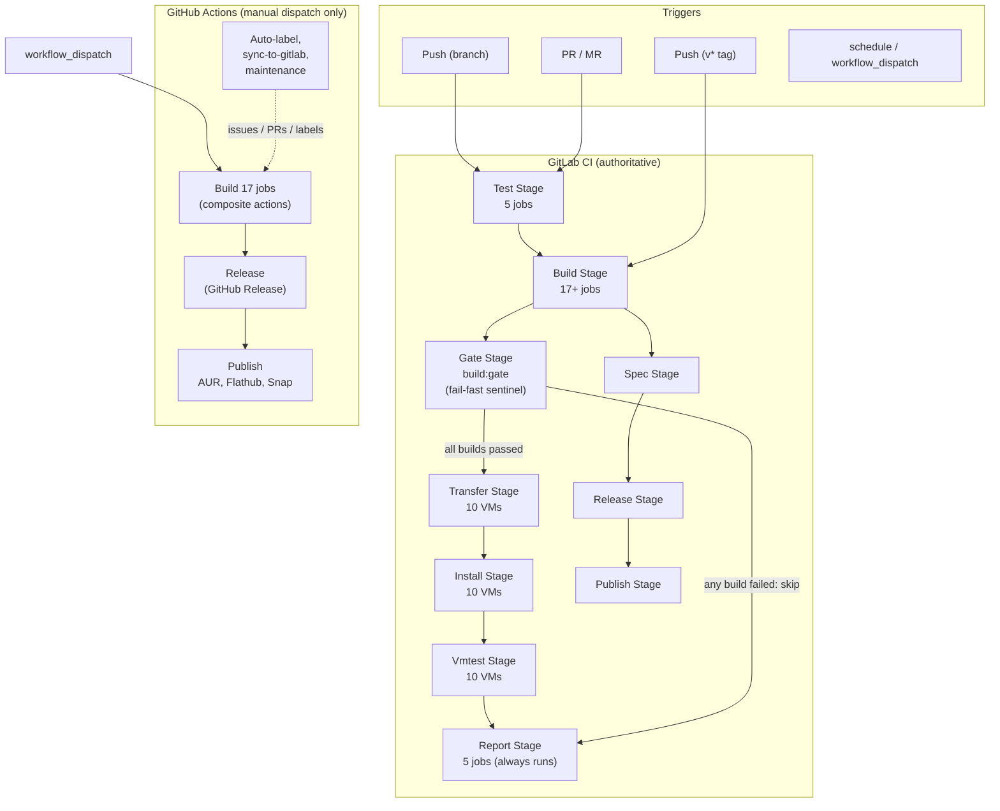

# CI/CD Pipeline — proton-drive-linux

> Canonical documentation for the CI/CD pipeline architecture.
> Supersedes `ci-authority-and-mirroring.md` and `ci-cd-roadmap.md` as the
> single source of truth for pipeline structure, triggers, and conventions.

## Overview

The project runs **two CI systems** in parallel:

| System | Entrypoint | Role |
|--------|-----------|------|
| **GitLab CI** | `.gitlab-ci.yml` (62 lines, includes `.gitlab/workflows/*.yml` ~1,686 lines across 5 files) | **Authoritative** — build, spec, release, and publish originate here |
| **GitHub Actions** | `.github/workflows/package-workflows.yml` (588 lines) | **Mirror** — same build matrix on GitHub, triggerable via `workflow_dispatch` only |

**GitLab CI is the source of truth** for all builds, releases, and publishes.
GitHub Actions mirrors the build matrix so that GitHub-based contributors get CI
feedback without leaving the platform, but only GitLab CI output is the official
release artifact.

There is **no automated sync in the reverse direction** (GitLab → GitHub). GitHub
is the primary collaboration surface for issues/PRs; the `sync-to-gitlab.yml`
workflow pushes GitHub activity to GitLab, but GitLab-tracked items must be
manually cross-posted to GitHub.



## Pipeline Stages

GitLab CI runs eight sequential stages. The `gate` stage acts as a fail-fast
sentinel between the build compilers and the VM deployment chain:

```
test → build → gate → transfer → install → vmtest → report → spec/release/publish
```

If any build job fails, `build:gate` is skipped. Every `transfer/*` job needs
`build:gate`, so a single build failure cascades silently through transfer,
install, and vmtest (all skipped). The `report` stage always runs regardless.

### Test — 5 jobs (GitLab CI only)

Lightweight pre-flight checks that run before builds:

| Job | Container | Timeout | Purpose |
|-----|-----------|---------|---------|
| `test:login-routing-regression` | `alpine:latest` | 10m | Guards login/2FA routing invariants in `main.rs`, `proton_navigation.rs`, `webview_cookies.rs` |
| `test:sync-regression` | `alpine:latest` | 10m | Detects drift between GitLab and GitHub CI configs via `scripts/ci/regression/sync.sh` |
| `test:fmt` | `debian:12` | 10m | `cargo fmt --check` |
| `test:clippy` | `debian:12` | 30m | `cargo clippy` lint checks |
| `test:rust` | `debian:12` | 30m | `cargo test` — unit tests for login routing, webview cookies, and live sync |

The same regression checks also run on GitHub via `sanity.yml` (push/PR to `main`), covering login-routing regression, sync regression, and Rust unit tests — but no `fmt` or `clippy` checks on GitHub. No package building occurs there.

### Gate — 1 job (GitLab CI only)

`build:gate` is a lightweight Alpine job that sits between the build and
transfer stages. It declares `needs:` for all 10 distro build jobs that feed
into the VM deploy chain:

- `build:apk:alpine-3.20`, `build:apk:alpine-3.22`, `build:aur`
- `build:deb:debian-12`, `build:deb:debian-13`
- `build:deb:ubuntu-24.04`, `build:deb:ubuntu-26.04`
- `build:rpm:el10`, `build:rpm:fedora-43`, `build:rpm:opensuse-tumbleweed`

If any of those jobs fail, GitLab skips `build:gate`. Because every
`transfer/*` job also declares `needs: ["build:gate"]`, they are all skipped
too — and the skip propagates through install and vmtest automatically.

The `report` stage does **not** depend on `build:gate` and always runs,
producing a deployment-matrix report even for failed pipelines.

### Transfer, Install, Vmtest, Report — VM verification chain (GitLab CI only)

The old monolithic `verify` stage is replaced by four granular stages so failures
are pinpointed and reports are separated from test execution.

**Transfer** — SCPs the built artifact to each target VM. Emits a dotenv
(`REMOTE_PKG_PATH`) consumed by the install stage.

**Install** — SSHes into each VM and runs the distro-native package manager
install (`dnf`, `apt`, `pacman`, `apk`, `zypper`).

**Vmtest** — Runs regression checks and compositor-confirmed visual tests on each
VM. Visual tests use Xvfb + xdotool + scrot + tesseract OCR to confirm the UI
actually appears on screen (process-alive is not sufficient). Each distro defines
a `distro_checks()` hook for package-manager-level assertions (architecture,
SELinux audit log, EPEL status, etc.). After a window is confirmed the test polls
OCR output for up to 15 s before asserting login-screen text, allowing the Tauri
WebKit renderer time to hydrate the React app on the VM.

**Report** — Five separate jobs aggregate results without blocking on each other:

| Job | Output | Viewing |
|-----|--------|---------|
| `report:deployment-matrix` | JUnit + Markdown matrix | MR Tests tab |
| `report:robot-html` | Robot Framework HTML | Artifact browser |
| `report:pytest-html` | pytest HTML | Artifact browser |
| `report:ui-screenshots` | Compositor screenshot gallery | Artifact browser |
| `pages` | Aggregated dashboard | GitLab Pages (requires DNS) |

**Build deduplication:** builds are skipped when no source file changed. Transfer
still runs using the last successful artifact from this branch. See
[Build Deduplication and Artifact Reuse](./build-deduplication.md) for the full
mechanism including `fetch-latest-artifact.sh` and `optional: true` semantics.

**VM inventory** (10 VMs, 192.168.1.0/24 network, SSH via deploy key):

| Job prefix | Distro | Package format |
|------------|--------|----------------|
| `*:debian-12` | Debian 12 | `.deb` |
| `*:debian-13` | Debian 13 | `.deb` |
| `*:ubuntu-24.04` | Ubuntu 24.04 | `.deb` |
| `*:ubuntu-26.04` | Ubuntu 26.04 | `.deb` |
| `*:alpine-3.20` | Alpine 3.20 | `.apk.tar.gz` |
| `*:alpine-3.22` | Alpine 3.22 | `.apk.tar.gz` |
| `*:rpm-el10` | CentOS Stream 10 | `.rpm` |
| `*:rpm-fedora-43` | Fedora 43 | `.rpm` |
| `*:rpm-opensuse-tumbleweed` | openSUSE Tumbleweed | `.rpm` |
| `*:aur` | Arch Linux | `.pkg.tar.zst` |

### Build — 17 distro packages

Each build job runs in a distro-specific container, clones the WebClients repo,
applies the distro-specific patch, builds the Tauri binary, and packages the
output. The common flow is:

1. Install system dependencies (compilers, libs, node)
2. Install Rust toolchain
3. Clone `WebClients` from `github.com/ProtonMail/WebClients` at `main`
4. Apply distro patch from `patches/<format>/<variant>.patch`
5. Run `scripts/build-webclients.sh` (web app build)
6. Sync `package.json` version to `tauri.conf.json` and `Cargo.toml`
7. `npm install` + `cargo build --release`
8. Package binary and icons into distro format
9. Copy to `artifacts/` directory

| Build job | Container/Image | Output format |
|-----------|-----------------|---------------|
| `build:apk:alpine-3.20` | `alpine:3.20` | `.apk.tar.gz` |
| `build:apk:alpine-3.22` | `alpine:3.22` | `.apk.tar.gz` |
| `build:apk:alpine-3.23` | `alpine:3.23` | `.apk.tar.gz` |
| `build:appimage` | `debian:12` | `.AppImage` |
| `build:aur` | `archlinux:base-devel` | `.pkg.tar.zst` |
| `build:deb:debian-12` | `debian:12` | `.deb` |
| `build:deb:debian-13` | `debian:13` | `.deb` |
| `build:deb:ubuntu-24.04` | `ubuntu:24.04` | `.deb` |
| `build:deb:ubuntu-26.04` | `ubuntu:26.04` | `.deb` |
| `build:flatpak:gnome-49` | `ubuntu:24.04` (extra flatpak layers) | `.flatpak` |
| `build:flatpak:gnome-50` | `ubuntu:24.04` (extra flatpak layers) | `.flatpak` |
| `build:rpm:el10` | `quay.io/centos/centos:stream10` | `.rpm` |
| `build:rpm:fedora-43` | `fedora:43` | `.rpm` |
| `build:rpm:fedora-44` | `fedora:44` | `.rpm` |
| `build:rpm:opensuse-tumbleweed` | `opensuse/tumbleweed:latest` | `.rpm` |
| `build:snap:core24` | `ubuntu:24.04` + `docker:dind` | `.snap` |
| `build:snap:core26` | `ubuntu:24.04` + `docker:dind` | `.snap` |

**Known issues and workarounds:**
- `build:rpm:el10` carries `retry: 1` — the parallel webpack phase can exhaust
  shared runner RAM and get SIGKILL'd; a single automatic retry recovers reliably.
- `build:snap:core26` uses `ghcr.io/canonical/snapcraft:stable` (snapcraft 9.x)
  because the older `8_core24` image returns `Unknown base 'core26'`. The job is
  still marked `allow_failure: true` / `continue-on-error: true` while the
  Canonical snap ecosystem for core26 matures.
- All build jobs have a 2-hour timeout and per-job Rust caches (`.cargo/` +
  `src-tauri/target/`) with a 2-hour TTL.

### Spec (GitLab CI only)

Package specification generation runs in the `spec` stage. These jobs are **not
mirrored** in GitHub Actions.

| Job | Output | Container |
|-----|--------|-----------|
| `spec:aur-pkgbuild` | `PKGBUILD` for AUR | `node:22` |
| `spec:rpm-spec` | `proton-drive.spec` for RPM | `node:22` |
| `spec:source-dist` | Source tarball + SHA256 | `alpine/git:latest` |

All spec jobs use `.rules:build` (run on MR, branch, or tag push). Artifacts
expire after 90 days (vs 30 for build artifacts).

### Release

Aggregates artifacts from all 17 build jobs and creates a release.

**GitLab CI** (`release` stage):
- Triggered by `.rules:release` — push to `main` or tags matching `v*`
- Uploads artifacts to the GitLab Generic Package Registry
- Creates a GitLab Release with asset links via `release-cli`
- Collects `.AppImage`, `.deb`, `.rpm`, `.flatpak`, `.snap`, `.pkg.tar.zst`,
  `.apk.tar.gz` from every job's `artifacts/` directory

**GitHub Actions** (`release` job in `package-workflows.yml`):
- Triggered only via `workflow_dispatch` with `workflow: release` input
- Has `needs:` on all 17 build jobs (must all complete)
- Creates a GitHub Release via `.github/workflows/maintenance/release/action.yml`
- 360-minute timeout (accounts for waiting on all builds)

### Publish

Manual step for tag pushes only (`.rules:publish` in GitLab, `workflow_dispatch`
with specific `publish-*` input in GitHub).

| Channel | GitLab job | GitHub job | Mechanism | Secrets |
|---------|-----------|-----------|-----------|---------|
| AUR (`aur.archlinux.org`) | `publish:aur` | `publish_aur` | SSH key push | `AUR_SSH_PRIVATE_KEY` |
| Flathub (`github.com/flathub`) | `publish:flatpak` | `publish_flatpak` | SSH key push | `FLATHUB_SSH_PRIVATE_KEY` |
| Snap Store (`snapcraft.io`) | `publish:snap` | `publish_snap` | `snapcraft upload` | `SNAPCRAFT_STORE_CREDENTIALS` |

### GitHub-Only Workflows

These workflows run only on GitHub and have no GitLab equivalent:

| Workflow | Purpose |
|----------|---------|
| `sync-to-gitlab.yml` | Mirror issues, PRs, comments to GitLab |
| `issue-auto-label` (in maintenance/) | Auto-label issues based on content |
| `pr-auto-label` (in maintenance/) | Auto-label PRs based on content |
| `maintenance/release` | Compose release metadata |

### GitHub Workflow Triggers

The `package-workflows.yml` workflow (the package-build mirror) triggers only on:

- `pull_request_target` (opened) — auto-label only
- `issues` (opened) — auto-label only
- `workflow_dispatch` — manual invocation with input parameters (`workflow`, `distro_patch`, `tag`, `version`, `snap_base`, `channel`)

There is **no push, pull_request, schedule, or release trigger** on the package workflow.
All build jobs require `workflow_dispatch`, gated by an `if: github.event_name == 'workflow_dispatch'` condition.

A separate **`sanity.yml`** workflow runs on `push` (to `main`, `alpha`, `feature/**`, `fix/**`, `chore/**`) and `pull_request` (to `main`), but only performs regression checks — it does **not** build packages.

Package, spec, release, and publish jobs are tag-only. In GitLab they require a `v*` tag pipeline. In GitHub, `package-workflows.yml` remains manually dispatched, but package/spec/release/publish jobs additionally require the selected dispatch ref to be a `v*` tag (`refs/tags/v*`).

Concurrency is grouped by workflow name + branch/ref, cancelling in-progress runs on duplicates.

## Trigger Rules

| Event | GitLab CI | GitHub Actions |
|-------|-----------|----------------|
| PR / MR | Test jobs only — no package/spec builds | Regression checks only (sanity.yml) + auto-label |
| Branch push | Test jobs only — no package/spec builds | Regression checks only (sanity.yml) |
| Tag push (`v*`) | Build + spec + release + publish (manual) | Package workflow may be manually dispatched on the tag ref only |
| Main branch push | Test jobs only — no package/spec builds/release | Regression checks only (sanity.yml) |
| Manual dispatch | Tests only unless the ref is a `v*` tag | Package/spec/release/publish jobs require manual dispatch on a `v*` tag ref |
| Issues opened | — | Auto-label |
| Release published | — | Manual `workflow_dispatch` only |

## Build Matrix — GitLab ↔ GitHub Mirror

Every GitLab build job has a corresponding GitHub composite action:

| GitHub job | Mirrors GitLab job |
|-----------|-------------------|
| `build_apk_alpine_3_20` | `build:apk:alpine-3.20` |
| `build_apk_alpine_3_22` | `build:apk:alpine-3.22` |
| `build_apk_alpine_3_23` | `build:apk:alpine-3.23` |
| `build_appimage` | `build:appimage` |
| `build_aur` | `build:aur` |
| `build_deb_debian_12` | `build:deb:debian-12` |
| `build_deb_debian_13` | `build:deb:debian-13` |
| `build_deb_ubuntu_24_04` | `build:deb:ubuntu-24.04` |
| `build_deb_ubuntu_26_04` | `build:deb:ubuntu-26.04` |
| `build_flatpak_gnome_49` | `build:flatpak:gnome-49` |
| `build_flatpak_gnome_50` | `build:flatpak:gnome-50` |
| `build_rpm_el10` | `build:rpm:el10` |
| `build_rpm_fedora_43` | `build:rpm:fedora-43` |
| `build_rpm_fedora_44` | `build:rpm:fedora-44` |
| `build_rpm_opensuse_tumbleweed` | `build:rpm:opensuse-tumbleweed` |
| `build_snap_core24` | `build:snap:core24` |
| `build_snap_core26` | `build:snap:core26` |

Each GitHub composite action lives at:
`.github/workflows/<type>/<variant>/action.yml`

GitHub additionally generates package specs via three jobs under
`generate_package_specs_*` (mirroring the GitLab `spec` stage), and runs
issue/PR auto-label and sync-to-gitlab workflows that have no GitLab analog.

The `release` job on GitHub has `needs:` on all 17 build jobs, matching the
GitLab release stage's `needs:` list.

## CI Scripts

### `scripts/ci/regression/sync.sh`

A pre-flight gate that detects drift between the dual CI configurations.
Compares the GitLab build stage against GitHub workflows and exits non-zero
when a target is missing in one system or misaligned.

**Environment variables:**
- `PROTOND_REPO_ROOT` — repo root (default: `.`)
- `PROTOND_CI_MODE` — `gitlab`, `github`, or `auto` (default: auto-detect
  from CI env vars)
- `PROTOND_COMPARE_SRC` — `gitlab` or `github`; which system is the source
  of truth (default: `gitlab`)

**Exit codes:**
- `0` — no regressions (all targets present in both systems)
- `1` — regression detected (missing target, misaligned stage)
- `2` — configuration error (missing yq/jq, broken files)

**Dependencies:** `bash >= 4.0`, `yq v4+`, `jq >= 1.6`

### `scripts/ci/lib/write-artifact-manifest.sh`

Scans a build output directory and writes a JSON manifest listing every
artifact (filename, size, SHA256, MIME type). Consumed by release/publish
steps to verify all expected artifacts are present before signing or uploading.

**Usage:**
```bash
./scripts/ci/lib/write-artifact-manifest.sh target/release/ manifest.json
```

**Exit codes:**
- `0` — manifest written successfully
- `1` — artifact directory does not exist
- `2` — no artifacts found
- `3` — output file not writable or invalid JSON

**Output format:**
```json
{
  "build_id": "<CI_JOB_ID or GITHUB_RUN_ID or local-timestamp>",
  "created_at": "2026-05-28T08:00:00Z",
  "artifacts": [
    {
      "name": "protondrive-1.2.3-x86_64.AppImage",
      "path": "dist/protondrive-1.2.3-x86_64.AppImage",
      "size_bytes": 12345678,
      "sha256": "abcdef...",
      "mime_type": "application/x-iso9660-appimage"
    }
  ]
}
```

### Other CI Scripts

Build logic is defined inline in `.gitlab/workflows/builds.yml`. The remaining
CI scripts are split into subdirectories under `scripts/ci/`:

| Directory | Contents |
|-----------|---------|
| `scripts/ci/build/` | `aur-package.sh` — AUR package build |
| `scripts/ci/install/<distro>/` | Per-distro install scripts run on VMs |
| `scripts/ci/transfer/<distro>/` | Per-distro SCP transfer scripts |
| `scripts/ci/vmtest/<distro>/` | Per-distro GUI load + regression test scripts |
| `scripts/ci/lib/` | Shared helpers: `_vm_common.sh`, `_test_common.sh`, `gui-load-check.sh`, `ui-test-compositor.sh`, `install-rust.sh`, `fetch-latest-artifact.sh`, `write-artifact-manifest.sh` |
| `scripts/ci/regression/` | `sync.sh` (CI drift check), `login-routing.sh`, `sync.sh` (regression suite) |

**openSUSE Tumbleweed install note:** The RPM package declares
`Requires: libayatana-appindicator-gtk3` (the Fedora capability name). openSUSE
packages the same library under a different name, causing `zypper` to reject the
install. The install script uses `rpm -i --nodeps --force` instead — the library
is present at runtime on openSUSE TW despite the capability name mismatch.

## Cross-Distro Patch System

Each OS variant has a patch file in `patches/<format>/<variant>.patch` that
adapts the WebClients checkout for that distro. The patch application strategy
varies by format:

| Patch directory | Apply strategy |
|----------------|---------------|
| `patches/apk/` | Idempotent: `git apply --reverse --check` then `git apply` |
| `patches/appimage/` | Direct: `git apply` (error if missing) |
| `patches/aur/` | Direct: `git apply` (error if missing) |
| `patches/deb/` | Direct: `git apply` (warning if missing) |
| `patches/flatpak/` | Direct: `git apply` (warning if missing) |
| `patches/rpm/` | Idempotent for EL10, Fedora, openSUSE |
| `patches/snap/` | Idempotent: `git apply --reverse --check` then `git apply` |

## Issue and PR Mirroring: GitHub → GitLab

The `sync-to-gitlab.yml` workflow ensures GitLab-side contributors see the
full discussion history:

- **Issues** — Created/updated in GitLab with `[GH#N]` prefix. State changes
  mirrored.
- **Pull requests** — Synced as GitLab issues with `[GH-PR#N]` prefix and
  `github-pr` label.
- **Comments** — Posted as GitLab notes on the corresponding mirrored issue.
  Deletions are skipped.
- **Credentials** — Uses `GITLAB_SYNC_TOKEN` secret, targets
  `gitlab.dicematrix.cloud`.

## Security Notes

- Snap builds require `docker:dind`. The GitLab runner must have
  `privileged = true` in its config.
- AUR publish uses SSH keys (`AUR_SSH_PRIVATE_KEY`) to push to
  `aur@aur.archlinux.org`.
- Flathub publish uses SSH keys (`FLATHUB_SSH_PRIVATE_KEY`) to push to
  `git@github.com:flathub/com.proton.drive.git`.
- Snap Store publish uses `SNAPCRAFT_STORE_CREDENTIALS` with
  `snapcraft upload`.
- All build artifacts expire after 30 days; spec artifacts expire after 90.
- Scripts clean up SSH keys in `after_script` blocks.

## Local vs CI

You can reproduce most CI build steps locally:

| Step | CI equivalent | Local command |
|------|--------------|---------------|
| WebClients build | `scripts/build-webclients.sh` | Same script |
| Version sync | Inline sed commands | Same sed commands |
| Rust build | `cargo build --release` | `cd src-tauri && cargo build --release` |
| Patch application | `git apply patches/<type>/<variant>.patch` | Same |
| Sync check | `scripts/ci/regression/sync.sh` | Same script (needs `yq`, `jq`) |
| Artifact manifest | `scripts/ci/write-artifact-manifest.sh` | Same script |
| DEB package | `npx tauri build --bundles deb` | Same (needs system deps) |
| RPM package | `npx tauri build --bundles rpm` | Same (needs system deps) |
| AUR package | `scripts/ci/build-aur-package.sh` | Same (needs Arch tooling) |
| APK archive | Inline tar commands | Manual tar of staged dir |
| Flatpak bundle | `flatpak-builder` commands | Same (needs flatpak tooling) |
| AppImage | `appimagetool` commands | Same |

Most build jobs require the distro-specific dependencies and Rust toolchain.
To run a full build locally without installing dependencies, use the docker
command from the CI job:
```bash
docker run --rm -v "$PWD:/workspace" -w /workspace <image> bash -c '
  apt-get update && apt-get install -y <deps> && scripts/build-webclients.sh && ...'
```

## Adding a New Build Target

1. **GitLab CI first** — add the job to `.gitlab-ci.yml` using the
   `.rules:build` template, distro-specific container image, and version/patch
   extraction logic. See `docs/build-packaging/new-build-checklist.md`.
2. **GitHub mirror** — create a composite action at
   `.github/workflows/<type>/<variant>/action.yml` and register it in
   `package-workflows.yml`.
3. **Release stage** — add the new build job to `release`'s `needs` list in
   both `.gitlab-ci.yml` and `package-workflows.yml`.
4. **Publish (if applicable)** — add a `publish:` job to `.gitlab-ci.yml` and
   an optional publish action under `.github/workflows/`.

## Quick Reference

| Need | System | File |
|------|--------|------|
| Review build pipeline definition | GitLab CI | `/.gitlab-ci.yml` + `.gitlab/workflows/builds.yml` |
| Review GitHub mirror of build matrix | GitHub Actions | `/.github/workflows/package-workflows.yml` |
| Inspect a specific build action | GitHub Actions | `/.github/workflows/<type>/<variant>/action.yml` |
| View issue/PR sync rules | GitHub Actions | `/.github/workflows/sync-to-gitlab.yml` |
| View auto-label rules | GitHub Actions | `/.github/workflows/maintenance/` |
| Understand the fail-fast gate | GitLab CI | `build:gate` job in `.gitlab/workflows/builds.yml` |
| Add a new build target | Both | `docs/build-packaging/new-build-checklist.md` |
| Understand packaging conventions | Docs | `docs/build-packaging/packaging.md` |
| Inspect CI VM scripts | GitLab CI | `scripts/ci/{install,transfer,vmtest,lib}/` |
| Check CI sync health | Both | `scripts/ci/regression/sync.sh` |
| Generate artifact manifest | Both | `scripts/ci/lib/write-artifact-manifest.sh` |

## Known Gaps

| Gap | Impact | Tracked in |
|-----|--------|-----------|
| No artifact signing | Users cannot verify download provenance | Roadmap |
| No SBOM | Downstream packagers cannot validate deps | Roadmap |
| Snap core26 `allow_failure` | Builds with `ghcr.io/canonical/snapcraft:stable`; marked non-blocking while core26 ecosystem stabilises | Roadmap |
| First-build cliff on new branches | CI-only change on a brand-new branch fails artifact fetch (404) | `fetch-latest-artifact.sh` error message guides fix |
| No artifact source-state cross-check | Fetched artifact is not verified against current Cargo.lock hash | Low risk; only affects CI-only commits |
| Docs commits run vmtest | Only builds have `changes:` gates; vmtest runs on all commits conservatively | Acceptable; add `changes:` to transfer base if runner cost grows |
| openSUSE RPM dependency mismatch | `libayatana-appindicator-gtk3` capability name differs on TW; install uses `--nodeps` workaround | Fix RPM spec to use conditional `%if` for openSUSE |
