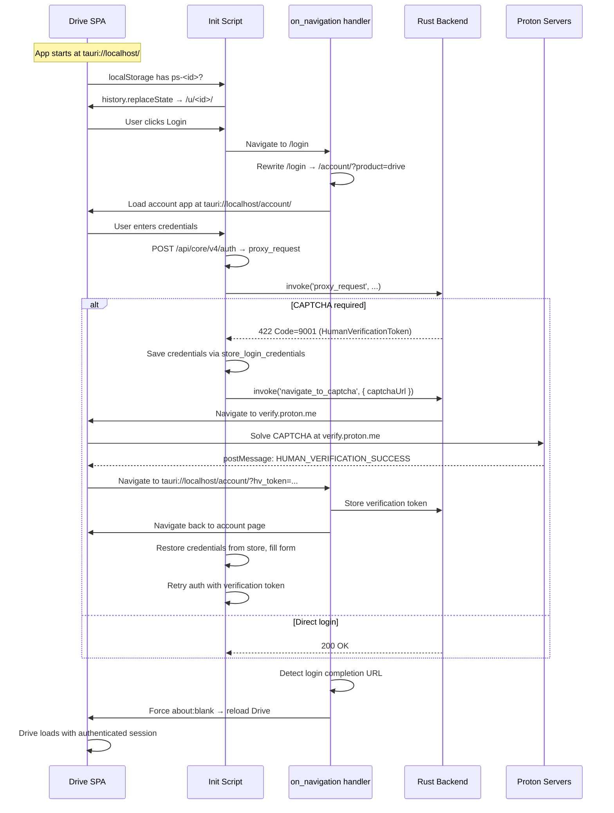

# SSO & Authentication Flow

Proton uses a centralized single sign-on system: `account.proton.me` handles login, two-factor authentication, and CAPTCHA for all Proton services. The native client rewrites this entire flow to local URLs while preserving all security properties.

## Overview of the flow



## Step-by-step details

### 1. Session restoration (before any SSO)

When the app starts at `tauri://localhost/`, the init script checks for persisted sessions:

```javascript
if (window.location.protocol === 'tauri:'
    && window.location.hostname === 'localhost'
    && window.location.pathname === '/') {

    const sessionKey = Object.keys(localStorage).find(key => /^ps-\d+$/.test(key));
    const localId = sessionKey && sessionKey.slice(3);
    if (localId) {
        history.replaceState({}, '', `/u/${localId}/`);
    }
}
```

Proton stores sessions in localStorage as `ps-<localID>` (e.g., `ps-12345`). If a session key exists, the init script rewrites the URL to `/u/<localID>/` so React Router starts on the correct user route. This **avoids a full login loop** — without this, Drive treats the root path as "no session" and redirects back to login.

### 2. Login redirect interception

When the SPA navigates to `/login`, the `on_navigation` handler intercepts:

```rust
if url.path().starts_with("/login") {
    let mut query_parts: Vec<String> = vec!["product=drive".to_string()];
    if let Some(q) = url.query() {
        for part in q.split('&') {
            if !part.starts_with("reason=") && !part.starts_with("type=") {
                query_parts.push(part.to_string());
            }
        }
    }
    let local_url = format!("tauri://localhost/account/?{}", query_parts.join("&"));
    // Navigate to local account app
    return false; // Block original navigation
}
```

Key behavior:
- Always adds `product=drive` so the account app knows to redirect to Drive after login
- Strips `reason=` and `type=` query params (session-expired indicators that would interfere)
- Preserves other query params (like return URLs)

### 3. External URL rewriting

Any navigation to `account.proton.me` or `drive.proton.me` is rewritten to local:

```rust
if url.host_str() == Some("account.proton.me") {
    let local_url = format!("tauri://localhost/account{}{}", path, query);
    // Navigate locally, block original
    return false;
}

if url.host_str() == Some("drive.proton.me") {
    let local_url = format!("tauri://localhost{}{}", path, query);
    return false;
}
```

### 4. Login completion detection

After successful authentication, the account app redirects through `account.proton.me`. The navigation handler detects this:

```rust
if let Some(drive_url) = account_login_complete_redirect_url(url) {
    // Force about:blank first to kill the account document
    // Then load Drive fresh
    window.eval("window.location.replace('about:blank');");
    tokio::time::sleep(Duration::from_millis(250)).await;
    window.navigate(drive_url.parse().unwrap());
    return false;
}
```

**Why `about:blank`?** WebKitGTK can update the URL bar without replacing the document on same-origin navigations. If the account app's document stays alive, the Drive init script never reinstalls IPC hooks (fetch/XHR overrides, proxy chain, etc.), and the Drive SPA is broken. Forcing `about:blank` kills the old document entirely, ensuring the init script runs fresh.

### 5. Unsupported app redirects

If the user somehow navigates to other Proton apps (Calendar, Mail, VPN, Pass), they get redirected back to Drive:

```rust
fn unsupported_app_redirect_url(url: &Url) -> Option<String> {
    let unsupported_hosts = ["calendar.proton.me", "mail.proton.me", "vpn.proton.me", "pass.proton.me"];
    if unsupported_hosts.contains(&url.host_str()?) {
        Some("tauri://localhost/".to_string())
    } else {
        None
    }
}
```

## CAPTCHA / Human Verification

Proton requires human verification (CAPTCHA) in some login scenarios. The native client handles this with a state machine spanning JavaScript and Rust.

### State tracking globals

```rust
static CAPTCHA_RETURN_URL: Mutex<Option<String>> = Mutex::new(None);
static ON_CAPTCHA_PAGE: AtomicBool = AtomicBool::new(false);
static PENDING_VERIFICATION: Mutex<Option<(String, String)>> = Mutex::new(None);  // (token, token_type)
static PENDING_CREDENTIALS: Mutex<Option<(String, String)>> = Mutex::new(None);   // (username, password)
```

All four are **zero-trust in-memory state** — cleared after use, never persisted to disk.

### Detection (422 with Code 9001)

Proton's API returns HTTP 422 with a specific error code when CAPTCHA is required:

```json
{
    "Code": 9001,
    "Details": {
        "HumanVerificationToken": "...",
        "WebUrl": "https://verify.proton.me/?methods=captcha&token=..."
    }
}
```

The fetch override detects this:

```javascript
if (response.status === 422 && response.body) {
    const data = JSON.parse(response.body);
    if (data.Code === 9001 && data.Details?.HumanVerificationToken && !captchaPending) {
        captchaPending = true;

        // Save current login form values
        const emailInput = document.querySelector('input[name="email"], ...');
        const passInput = document.querySelector('input[name="password"], ...');
        if (emailInput?.value && passInput?.value) {
            await invoke('store_login_credentials', {
                username: emailInput.value,
                password: passInput.value
            });
        }

        // Navigate to verify.proton.me as top-level document
        invoke('navigate_to_captcha', {
            captchaUrl: data.Details.WebUrl,
            returnUrl: window.location.href
        });
    }
}
```

### Why top-level navigation?

The init script **blocks CAPTCHA iframes**:

```javascript
// Block captcha iframe loading
Element.prototype.setAttribute = function(name, value) {
    if (this.tagName === 'IFRAME' && name === 'src' && isCaptchaUrl(value)) {
        return; // Block
    }
    return origSetAttr.call(this, name, value);
};

// Also block property assignment on iframe src
Object.defineProperty(HTMLIFrameElement.prototype, 'src', {
    set: function(val) {
        if (isCaptchaUrl(val)) return; // Block
        iframeSrcDescriptor.set.call(this, val);
    },
    get: iframeSrcDescriptor.get
});
```

WebKitGTK cannot render hCaptcha inside an iframe. The only working approach is to navigate the entire window to `verify.proton.me`.

### Completion detection

The verify page posts a message when CAPTCHA is complete:

```javascript
window.addEventListener('message', async (event) => {
    if (event.data?.type === 'HUMAN_VERIFICATION_SUCCESS' && event.data.payload) {
        const token = event.data.payload.token;
        const tokenType = event.data.payload.type || 'captcha';
        window.location.href = 'tauri://localhost/account/?hv_token='
            + encodeURIComponent(token)
            + '&hv_type=' + encodeURIComponent(tokenType);
    }

    if (event.data?.type === 'pm_captcha' && event.data.token) {
        // hCaptcha-specific completion
        window.location.href = 'tauri://localhost/account/?hv_token='
            + encodeURIComponent(event.data.token)
            + '&hv_type=captcha';
    }
});
```

The `on_navigation` handler detects the `?hv_token=...` return URL:

```rust
if ON_CAPTCHA_PAGE.load(Ordering::SeqCst) {
    if let Some((token, token_type)) = captcha_completion_token(url) {
        ON_CAPTCHA_PAGE.store(false, Ordering::SeqCst);
        *PENDING_VERIFICATION.lock().unwrap() = Some((token, token_type));
        // Navigate back to account page
        window.navigate("tauri://localhost/account/".parse().unwrap());
        return false;
    }
}
```

### Credential auto-restore after CAPTCHA

After returning from CAPTCHA to the account page, the init script restores saved credentials:

```javascript
(async function() {
    if (!window.location.href.startsWith('tauri://')) return;

    const creds = await invoke('get_and_clear_login_credentials');
    if (creds && creds[0] && creds[1]) {
        const fillForm = () => {
            const emailInput = document.querySelector('input[name="email"], ...');
            const passInput = document.querySelector('input[name="password"], ...');
            if (emailInput && passInput) {
                setNativeValue(emailInput, creds[0]);
                setNativeValue(passInput, creds[1]);

                setTimeout(() => {
                    const submitBtn = document.querySelector('button[type="submit"]');
                    if (submitBtn) submitBtn.click();
                }, 500);
            } else {
                setTimeout(fillForm, 500); // Retry until form appears
            }
        };
        setTimeout(fillForm, 1500);
    }
})();
```

### Verification token injection on auth retry

When credentials are auto-filled and the login form is submitted, the fetch override injects the CAPTCHA verification token into the auth request:

```javascript
if (url.includes('/api/core/v4/auth')
    && !url.includes('/auth/cookies')
    && !url.includes('/auth/info')) {

    const verification = await invoke('get_and_clear_verification_token');
    if (verification) {
        cleanHeaders['x-pm-human-verification-token'] = verification[0];
        cleanHeaders['x-pm-human-verification-token-type'] = verification[1];
    }
}
```

The URL check is deliberately narrow (`/api/core/v4/auth` only, excluding `/auth/cookies` and `/auth/info`) to avoid injecting the one-time token into the wrong request.

### CAPTCHA URL allowlist

During the CAPTCHA flow, specific URLs are allowed that would normally be blocked:

```rust
let is_captcha_url = match url.host_str() {
    Some("mail.proton.me") => url.path().starts_with("/api/core/v4/captcha")
        || url.path().starts_with("/captcha/"),
    Some("verify.proton.me") => true,      // The verify app page
    Some("verify-api.proton.me") => true,   // API that serves captcha content
    _ => false,
};

// Also allow hCaptcha domains
if host == "hcaptcha.com" || host.ends_with(".hcaptcha.com") {
    return true;
}
```

### Important guard: `ON_CAPTCHA_PAGE` atomic

The `ON_CAPTCHA_PAGE` atomic prevents false completion detection. WebKitGTK emits internal `about:blank` and verify-API navigations during CAPTCHA that could be mistaken for completion. The state machine only processes `hv_token` parameters when `ON_CAPTCHA_PAGE` is `true`.

## WebView cookie management

Cookies live in WebKit's native cookie jar, not in the Rust proxy. The proxy:

1. **Reads cookies** from WebKit before each request via `combined_cookie_header(&window, &cookie_jar, &target_url)`
2. **Writes Set-Cookie** responses back to WebKit via `store_webview_cookie(&window, &target_url, cookie_value)`

This means WebKit handles all cookie lifecycle (expiry, domain matching, secure flags, etc.) exactly as a browser would. The Rust `reqwest` cookie jar (`Arc<Jar>`) is present but serves as a fallback — the primary cookie source is WebKit.
